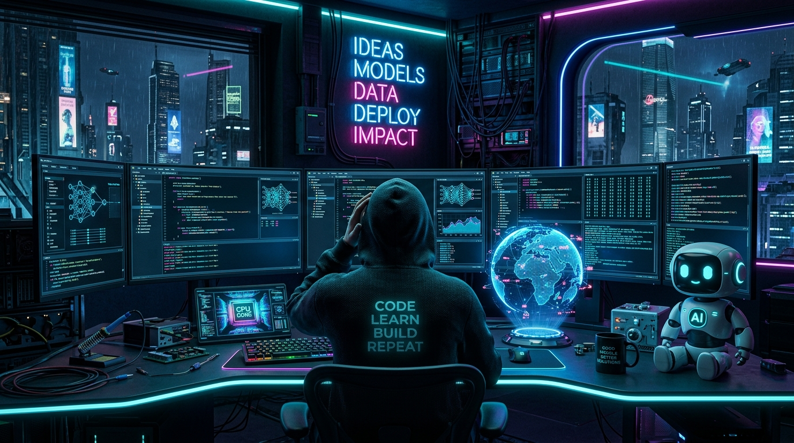

<div align="center">

<!-- Self-Hosted High-Resolution Cyber Banner (100% Reliable, Zero Downtime) -->


<br/><br/>

<!-- Animated Typing Subtitle -->
[](https://git.io/typing-svg)

<p align="center">
  
  
  
  
</p>

<!-- Quick Action Social Links -->
<p align="center">
  <a href="https://linkedin.com"></a>
  <a href="https://cinematch-1-gycb.onrender.com/"></a>
  <a href="mailto:ramdev14705252@gmail.com"></a>
</p>

</div>

---

### 🧬 About Me

```yaml
identity:
  name: Ram Dev
  role: AI / Machine Learning Developer
  mission: Building safe, autonomous agentic architectures and high-throughput AI pipelines
  current_focus:
    - Multi-Agent Orchestration & Sandboxed Code Execution
    - Retrieval-Augmented Generation (RAG) with Vector Databases
    - Real-Time Computer Vision & Edge ML Inference
```

---

### 🛠️ Technical Stack & Ecosystem

<div align="center">

| Category | Tools & Technologies |
| :--- | :--- |
| **AI / Deep Learning** |      |
| **Generative AI & LLMs** |   -8A2BE2?style=flat-square)  |
| **Languages & Core** |      |
| **Engineering & Cloud** |       |

</div>

---

### 🚀 Flagship Projects

<table>
  <tr>
    <td width="50%" valign="top">
      <h3 align="center">🛡️ Sandbox-Controller-AI</h3>
      <p>Secure Docker containment matrix for running autonomous AI agents with restricted kernel access, real-time memory monitoring, and automated safety policies.</p>
      <p align="center">
        <code>Python</code> <code>Docker</code> <code>AI Agents</code> <code>Containerization</code>
      </p>
      <p align="center">
        <a href="https://github.com/ramdev1470/Sandbox-Controller-AI"><b>[ View Repository → ]</b></a>
      </p>
    </td>
    <td width="50%" valign="top">
      <h3 align="center">📚 ResearchMate-AI</h3>
      <p>Multi-hop retrieval-augmented generation (RAG) research assistant performing vector search, semantic summarization, and citation tracking across academic papers.</p>
      <p align="center">
        <code>Python</code> <code>LangChain</code> <code>Vector Embeddings</code> <code>FastAPI</code>
      </p>
      <p align="center">
        <a href="https://github.com/ramdev1470/ResearchMate-AI"><b>[ View Repository → ]</b></a>
      </p>
    </td>
  </tr>
  <tr>
    <td width="50%" valign="top">
      <h3 align="center">🐕 PET-AI</h3>
      <p>Real-time edge computer vision and behavioral recognition pipeline using OpenCV and machine learning classifiers for automated pet monitoring.</p>
      <p align="center">
        <code>Python</code> <code>Computer Vision</code> <code>OpenCV</code> <code>ML Models</code>
      </p>
      <p align="center">
        <a href="https://github.com/ramdev1470/PET-AI"><b>[ View Repository → ]</b></a>
      </p>
    </td>
    <td width="50%" valign="top">
      <h3 align="center">🎬 CineMatch</h3>
      <p>Content-based & collaborative filtering recommendation platform featuring sentiment NLP embeddings and high-accuracy movie match scoring.</p>
      <p align="center">
        <code>Python</code> <code>NLP</code> <code>Transformers</code> <code>Render Cloud</code>
      </p>
      <p align="center">
        <a href="https://github.com/ramdev1470/CineMatch"><b>[ View Repository → ]</b></a> • 
        <a href="https://cinematch-1-gycb.onrender.com/"><b>[ Live Demo → ]</b></a>
      </p>
    </td>
  </tr>
  <tr>
    <td width="50%" valign="top">
      <h3 align="center">📍 WAYBACK-AI</h3>
      <p>Spatial path planning and memory mapping engine powered by spatial heuristics and AI route discovery.</p>
      <p align="center">
        <code>Python</code> <code>Spatial Mapping</code> <code>Algorithms</code>
      </p>
      <p align="center">
        <a href="https://github.com/ramdev1470/WAYBACK-AI"><b>[ View Repository → ]</b></a>
      </p>
    </td>
    <td width="50%" valign="top">
      <h3 align="center">⚡ GYM-TRACKER-V1</h3>
      <p>Progressive web app for workout logging, metric telemetry, and adaptive fitness progression analytics.</p>
      <p align="center">
        <code>JavaScript</code> <code>Web App</code> <code>Data Analytics</code>
      </p>
      <p align="center">
        <a href="https://github.com/ramdev1470/GYM-TRACKER-V1"><b>[ View Repository → ]</b></a>
      </p>
    </td>
  </tr>
</table>

---

### 🐍 Contribution Activity Stream

<div align="center">
  <picture>
    <source media="(prefers-color-scheme: dark)" srcset="https://raw.githubusercontent.com/ramdev1470/ramdev1470/output/github-contribution-grid-snake.gif">
    <source media="(prefers-color-scheme: light)" srcset="https://raw.githubusercontent.com/ramdev1470/ramdev1470/output/github-contribution-grid-snake.gif">
    
  </picture>
</div>

---

### 📊 GitHub Telemetry & Commit Streak

<div align="center">


</div>

---

<div align="center">
  <sub>Designed with ⚡ by <a href="https://github.com/ramdev1470">Ram Dev</a> • Powered by Continuous AI & GitHub Actions</sub>
</div>
